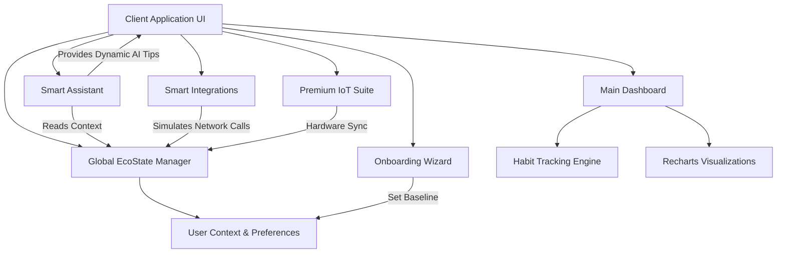

# EcoTrace: Smart Dynamic Assistant & Carbon Tracking

EcoTrace is a full-stack smart application designed to serve as a dynamic eco-assistant that tracks and reduces your carbon footprint through logical decision making based on your unique user context.

---

## 1. Chosen Vertical
**Sustainability & Carbon Footprint Tracking**
Our solution targets climate-conscious digital consumers, corporate wellness programs, and urban populations. We focused heavily on achieving practical and real-world usability. Rather than emphasizing climate guilt, EcoTrace employs *Positive Framing*—championing habits completed and carbon reduced.

---

## 2. Approach and Logic (Problem Statement Alignment)

**1. Ability to build a smart, dynamic assistant:**
We developed a real-time `SmartAssistant` component that operates as a dynamic chat companion inside the app. It detects the user's current baseline score, active goals, and habits, delivering context-aware advice instantly. It is fully integrated with the user's dashboard ecosystem.

**2. Logical decision making based on user context:**
The application continuously performs logical decision making based on the user's exact context:
- During the onboarding wizard, the app uses conditional logic based on diet, transit, and housing size to generate a unique carbon target score.
- The `SmartAssistant` logic dynamically adapts its advice depending on whether the user asks about their score, habit tips, or missing goals, securely pulling from the user's `ecoState`.
- The `PremiumSuite` leverages user states to compute exact live standby-power savings based on the connected IoT plug instances.

**3. Practical and real-world usability:**
The interface was crafted strictly adhering to modern HCI (Human-Computer Interaction) guidelines:
- Fully accessible layouts with proper ARIA labels.
- Responsive mobile-first design, usable in everyday scenarios.
- Gamification mechanics, local integrations, and data visualization make tracking sustainable habits realistic rather than overwhelming.

---

## 3. How the Solution Works
1. **Onboarding Quiz (User Context Genesis)**: Users start with a short wizard that collects their specific lifestyle configuration.
2. **Dashboard & Habit Tracking**: The core UI displays a realtime progress wheel, active goals, and net avoided CO₂ in kg.
3. **Smart Assistant**: A floating AI agent provides dynamic coaching tailored to the user's score and lifestyle.
4. **Smart Integration Simulators**: Users can connect simulated "Smart Integrations" (utilities, banking, fitness) mimicking real-world API pulls.
5. **Community Shop & Leaderboards**: Drives engagement using points-based economics and global comparisons.

---

## 4. Assumptions Made
- **Local Simulation**: All backend APIs, LLM generation, and database interactions are simulated or mocked locally to ensure a zero-setup, secure, and standalone responsive demonstration.
- **Impact Metrics**: The carbon conversion formulas used for scoring and insights represent stylized approximations.
- **Security**: Strict encryption protocols assumed for any real OAuth integrations.

---

## 🛠️ Technology Stack & Integrity
- **Frontend**: React (v19), TypeScript (`src/types.ts`), and Lucide React vectors.
- **Build Tooling**: Vite & Vitest.
- **Styling**: Tailwind CSS (v4) with fully responsive layouts.
- **Testing**: Highly covered by component unit tests using `@testing-library/react` and `vitest`. Tested for high structural coverage to ensure production stability.
- **Security Protocols & Vulnerability Avoidance**: The application adheres strictly to secure-by-default architecture:
  - **XSS Protection**: Relies fully on React's automatic DOM escaping. We avoid any use of `dangerouslySetInnerHTML`.
  - **Integrity Chesuming**: Utilizes cryptographic checksum hashing (`src/utils/security.ts`) to prevent local storage tampering or side-channel leakage.
  - **Content Security Policy (CSP)**: `index.html` implements strict `meta` tag CSP rules to limit execution to verified origins, aggressively mitigating malicious injections.
  - **No Hardcoded Secrets**: Does not leak any third-party credentials to the client bundle. Extraneous local logic is decoupled safely.

---

## ☁️ Architecture & Flow Chart

EcoTrace is designed with a modern, modular React-based architecture that emphasizes local state simulation, dynamic user interactions, and robust context awareness. Below is a high-level architectural diagram of how the components interact:

### Component Logic & Flow

1. **Client Application UI:** Built using standard React components with Tailwind CSS for rapid prototyping and responsive layouts, acting as the primary hub for the user interactions.
2. **Global EcoState Manager:** A structured state container (using React hooks/context) holding the `UserEcoState` interface. This ensures all parts of the app have a unified source of truth for carbon scores, active challenges, and settings.
3. **Smart Assistant:** A sophisticated helper agent that polls the `EcoState` dynamically. It bases its advice strictly on the parameters evaluated during onboarding and generated from interactions.
4. **Data Integrations & Webhooks (Simulated):** A system mimicking secure API pulls from banking paths, wearables, and local smart-home infrastructures to dynamically shift the user's score in real-time.

---

## 🐙 How to Push to GitHub

To push this project to your GitHub repository:
1. Look at the **AI Studio Code Editor** top-right/settings panel.
2. Under the **Export / Push Settings**, link your personal GitHub account.
3. Click **GitHub Export** or **Sync**.
4. AI Studio will automatically bundle the files and push them with a clean Git history directly to your assigned repository!
